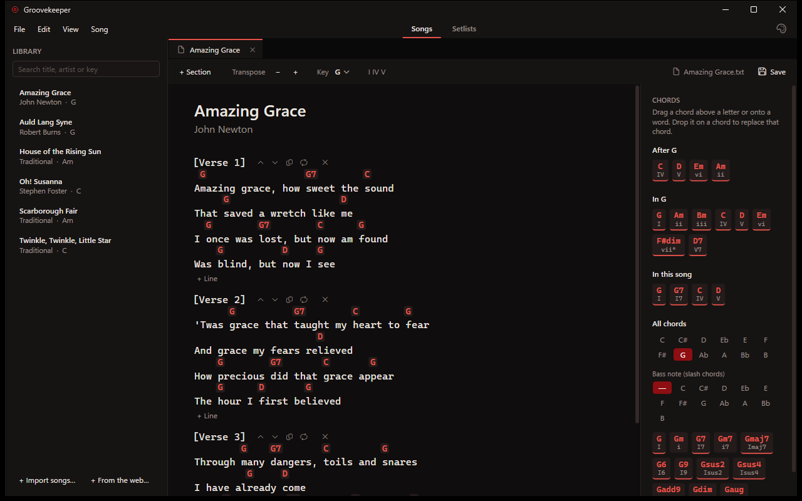
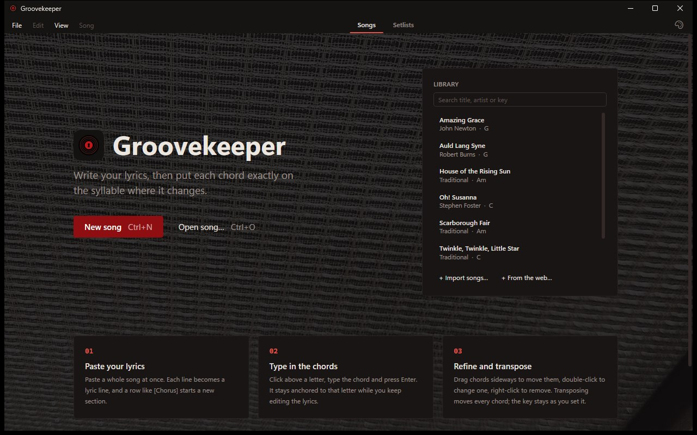
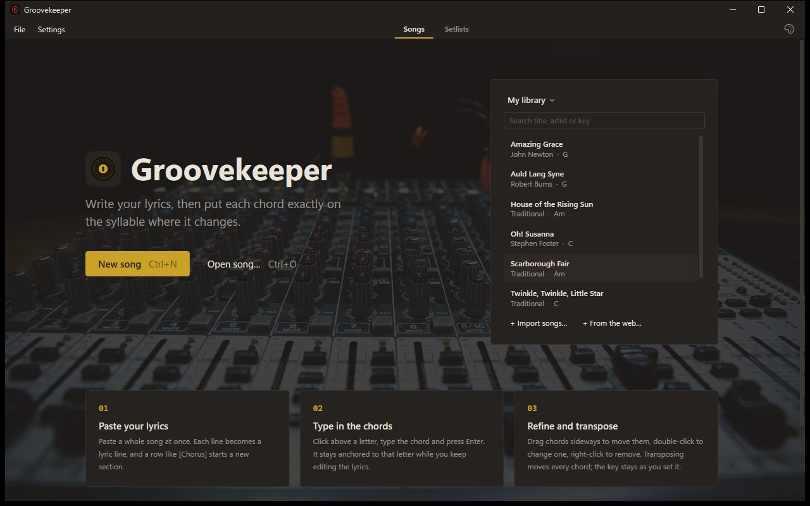
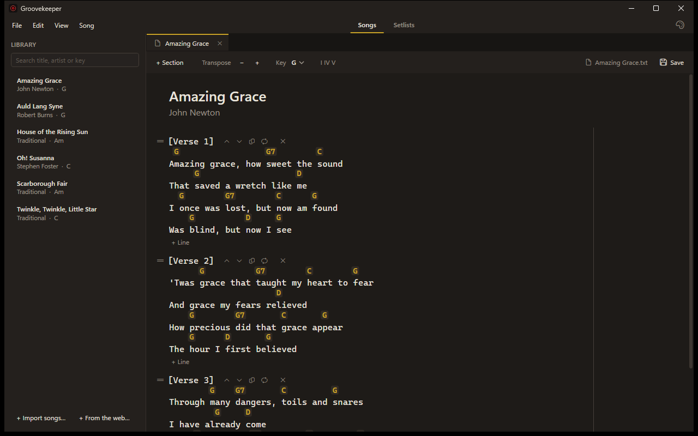
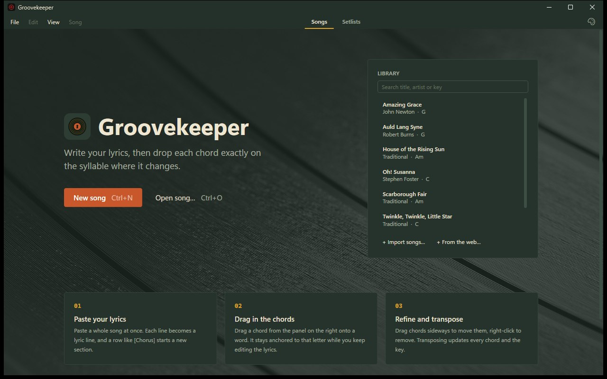
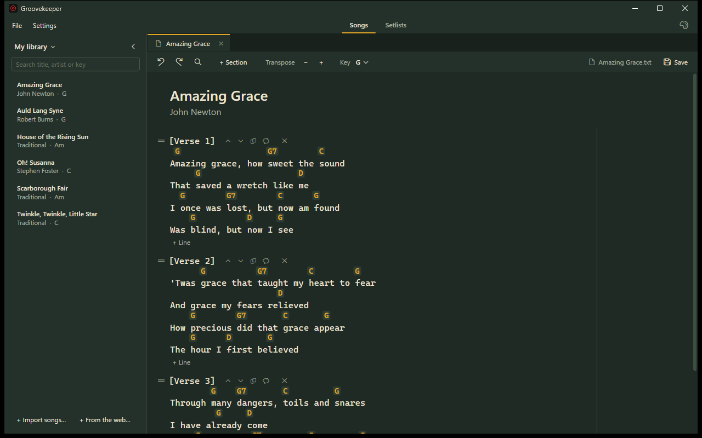
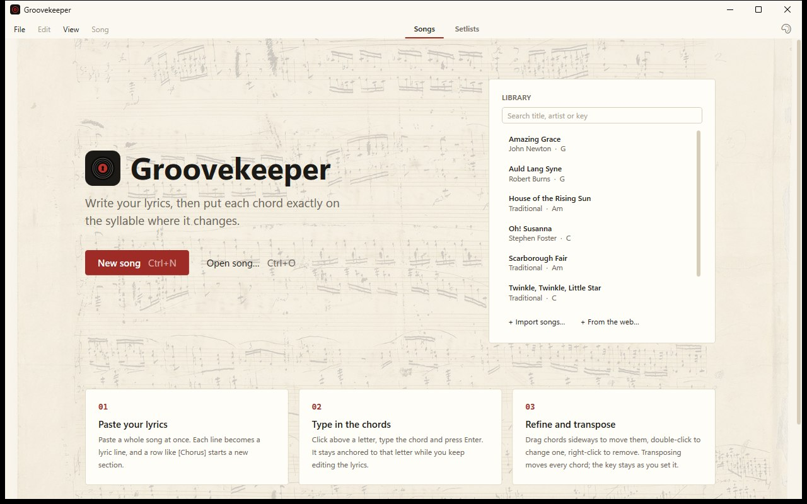
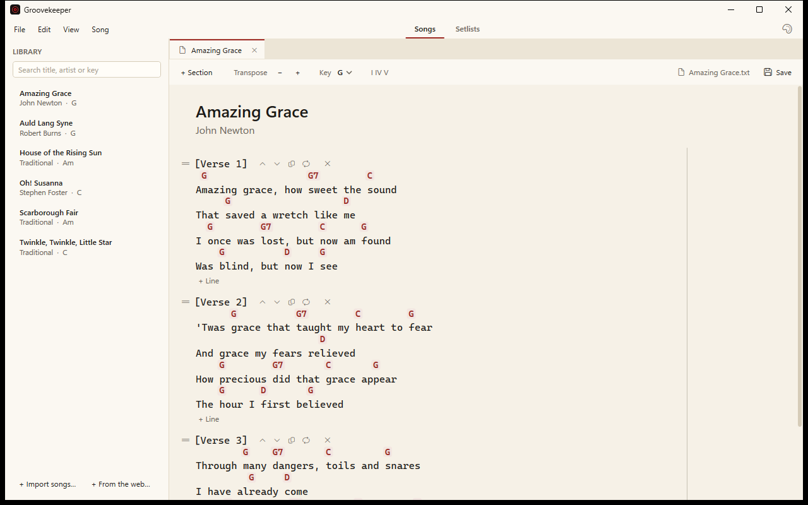

# Groovekeeper

A Windows desktop app for writing chord sheets: type the lyrics, type each chord exactly above the
syllable where it changes, then transpose, print, and build setlists for a gig.

Songs live in the app's library, with search, and you can still open and save song files:
plain `.txt` with the chords on the line above the lyrics, or the ChordPro format used by many
other chord apps.



## Install

Download `Groovekeeper-Setup.exe` from the latest
[release](https://github.com/xSetha/SongCreator/releases/latest) and run it. It installs Groovekeeper
for your Windows user, without administrator rights, and adds it to the Start menu and the desktop.
The app updates itself: a new version is downloaded in the background and installed the next
time you start it. Your songs and setlists are kept.

The installer isn't code-signed yet, so Windows may warn that it "protected your PC": click
**More info**, then **Run anyway**. If you'd rather not install anything, use
`Groovekeeper-Portable.zip` from the same release.

## Features

**Writing**
- Lyrics with a chord lane above each line. Chords stay anchored to their letter while you edit.
- Click the chord lane above a letter and type a chord; Enter places it, Esc cancels. Only real
  chords are accepted (`Am7`, `D/F#`, `Cmaj9#11`, …): anything else is refused with "Not a chord".
  Double-click a chord to change it (an empty name removes it), drag it sideways to move it,
  right-click to remove it.
- Sections (`[Verse 1]`, `[Chorus]`, …) that you can rename, duplicate or delete, and move by
  dragging the grip (⠿) next to the heading, or with the ↑ ↓ buttons. + Section adds a section
  after the one the caret is in (or at the end of the song).
- Repeat markers: "play the chorus again" without copying it. Shown as `[Chorus] (repeat)`.
- Notes anywhere over the song: right-click → Add note here. Drag a note by its top edge, type in
  it (Shift+Enter for a new line, Enter when done), right-click it to delete it. A note floats where
  you put it while the lyrics under it change, and the PDF prints it at the same spot. A faint
  vertical line marks the edge of the printed page. Notes are kept in the library, not in song
  files, so a song opened from a file is saved to the library before it gets one.
- Paste a whole song at once, including chords-over-lyrics text copied from chord sites.
- Drag with the mouse to select lyrics across lines, even across sections. Delete or Backspace
  deletes the selection with the chords above it and any section headings inside it, and joins
  what's left of the first and last lines, as in a text editor.
- Undo and redo for everything: typing, chords, sections and transposing.
- Find and replace in the lyrics (matches are highlighted) or in the chords, by exact name.
- Several songs open at once, each in its own tab. An icon on the tab and a label next to the
  Save button show where the song is saved: in the library, in a file, or not yet.

**Library**
- Every song you save goes into the library. It's listed on the start page and in a side panel
  next to the editor (Ctrl+B, or the « button in its header), sorted by title, with a search over title, artist and key.
  The app remembers whether the panel was open, and the window's size.
- Double-click a song to open it, right-click to delete it (it is also taken out of its setlists).
- Import `.txt` and ChordPro files into the library; the files themselves aren't changed.
- Back up the whole library to a single file (File → Back Up Library…).

**Import from the web**
- File → Import from Web… (Ctrl+I) opens a built-in browser. Search for a song, open its chord
  page, select the chords and lyrics (or nothing, to take the page's chord sheet), and press
  Import. The song opens as a new tab with its sections and chords; title and artist are
  guessed from the page title.
- The app never searches or downloads songs on its own. Songs on chord sites are usually
  copyrighted: import them for your own use, and check the site's terms before sharing.
- Needs the Microsoft Edge WebView2 Runtime, which comes with Windows 11 and most Windows 10 PCs.

**Song files**
- Open `.txt` and ChordPro files (`.cho`, `.chopro`, `.chordpro`, `.pro`) and edit them in place:
  Save writes the file, in its own format.
- Save As File writes a `.txt` or ChordPro file. For a library song it's a copy, and the song
  stays in the library.

**Music**
- The song's key is yours to set in the Key box; nothing else changes it.
- Transpose up or down by a semitone moves every chord in the song, and only the chords. They are
  spelled in the key they move to: `E A B7` moved up one becomes `F Bb C7`, not `F A# C7`.
- Roman numerals (`I IV V vi`, `ii7`, `bVII`, `I/3`), shown with the **I IV V** toggle on the
  chords in the editor, in the key set in the Key box.

**Printing and gigs**
- Export one or many songs to a single PDF songbook, with an optional table of contents
  and an option to print the chords as Roman numerals.
- "Collapse repeated sections" (on by default, for songbooks and setlists): a section that is
  exactly the same as an earlier one, with the same name, chords and lyrics, is printed as
  `[Chorus] (repeat)` instead of in full. The song itself isn't changed.
- Setlists, on their own tab (Ctrl+L, or Songs / Setlists at the top of the window): as many
  as you like, each with library songs in playing order, played as they are written. The same
  song can be in several setlists.
- Drag songs to reorder a setlist, and drag them in from the library next to it (or press +).
  Every change is saved in the library right away.
- Double-click a song in a setlist to edit it in the song editor. A setlist only refers to its
  songs, so the edit shows in every setlist that has it. To play a song in another key,
  transpose the song itself.
- Export a setlist to one PDF. Older `.setlist` files can be imported, together with their
  songs.

**Looks**
- Four themes: Amp (black and blood red), Backstage (charcoal and brass), Record Sleeve (forest
  green, cream and mustard) and Songbook (cream paper with red ink chords). Each has its own photo
  behind the start page; [CREDITS.md](CREDITS.md) lists where they come from.

| Theme | Start page | Editor |
| --- | --- | --- |
| Amp |  |  |
| Backstage |  |  |
| Record Sleeve |  |  |
| Songbook |  |  |

## Getting started

Requires Windows and the [.NET 10 SDK](https://dotnet.microsoft.com/download).

```powershell
dotnet run --project SongCreator     # start the app
dotnet test                          # run the tests
```

To try the app with some public-domain songs, import the files in `samples/songs` into the
library (File → Import Songs into Library…). The seed script copies them to a songs folder
first (by default `Documents\Groovekeeper\Songs`), if you'd rather import them from there:

```powershell
powershell -ExecutionPolicy Bypass -File scripts\seed-songs.ps1
```

Releases are built by `scripts/release.ps1` and published by a GitHub workflow when a version tag
is pushed. [docs/RELEASING.md](docs/RELEASING.md) has the version numbering and the steps.

Other scripts, each run with `powershell -ExecutionPolicy Bypass -File scripts\<name>.ps1`:

| Script | What it does |
| --- | --- |
| `prepare-release.ps1 -Version 1.5.0` | Sets the version, dates the changelog and commits both, ready to tag |
| `screenshots.ps1` | Retakes the screenshots in `docs/screenshots` with the sample songs. It runs the app on a sample library in place of yours (close the app first) and puts your library back afterwards |
| `make-icon.ps1` | Redraws the app icon and the installer's splash image |
| `check.ps1` | Runs every check before a commit: the desktop tests, the web typecheck and tests, the database's access rules and the end-to-end tests, then sums them up. Checks that need the local Supabase are skipped when it isn't running. `-SkipDesktop`, `-SkipE2E` leave parts out |
| `web-dev.ps1` | Starts what the web app needs while working on it: Docker Desktop, the local Supabase and the app at http://localhost:5173. `-Network` also serves it on the local network, for a phone |

## Keyboard shortcuts

| Shortcut | Action |
| --- | --- |
| Ctrl+N | New song |
| Ctrl+O | Open songs |
| Ctrl+S | Save (to the library, or to the song's file if it was opened from one) |
| Ctrl+Shift+S | Save as file |
| Ctrl+B | Show or hide the library panel |
| Ctrl+I | Import from the web |
| Ctrl+E | Export PDF |
| Ctrl+L | Setlists tab |
| Ctrl+Z | Undo |
| Ctrl+Y, Ctrl+Shift+Z | Redo |
| Ctrl+F, Ctrl+H | Find and replace (Enter: next match, Esc: close) |
| Enter | Split the line at the cursor |
| Backspace (at line start) | Join with the line above |
| Up / Down | Move between lines |

Closing a song (or the app) with unsaved changes asks whether to save it first.

## File formats

**Songs (`.txt`)**: title, artist, key, then sections. Chords sit above the letter they
belong to, and a `(Repeat)` line under a heading marks a repeat of that section. One blank line
separates sections; any other blank line is a blank line of the song, and an empty section is
just its heading, so a song reads back exactly as it was saved.

```text
Amazing Grace
John Newton

Key: G

[Verse 1]
 G                 G7        C
Amazing grace, how sweet the sound
     G                   D
That saved a wretch like me

[Verse 1]
(Repeat)
```

**Songs in ChordPro (`.cho`, `.chopro`, `.chordpro`, `.pro`)**: directives in braces and each
chord in brackets right before the letter it belongs to. Sections are saved as verse, chorus or
bridge environments, depending on their name. A chorus repeat is `{chorus}`; any other repeat is a
`{comment:}` heading naming an earlier section, with nothing under it. When reading, `{comment:}`
headings and paragraphs separated by blank lines also become sections. Directives the app has no
place for (capo, tempo, …) are skipped, so they are not kept when the song is saved.

```text
{title: Amazing Grace}
{artist: John Newton}
{key: G}

{start_of_verse: Verse 1}
A[G]mazing grace, how [G7]sweet the [C]sound
That [G]saved a wretch like [D]me
{end_of_verse}

{comment: Verse 1}
```

**Library (`%AppData%\SongCreator\library.db`)**: a SQLite database with the songs and the
setlists. The folder keeps the app's old name, SongCreator, so that nobody's library moves. Each song is stored as its `.txt` text, with its notes in a table beside it. Don't keep it in a folder that a cloud service
syncs while the app is open; use File → Back Up Library… to make a copy instead.

**Older setlists (`.setlist`)**: setlists used to be JSON files that point to song files. They can
be imported on the Setlists tab (Import…), which adds their songs to the library. The key these
files can give each song is ignored: the songs are added as they are written.

```json
{
  "name": "Friday gig",
  "songs": [
    { "path": "Amazing Grace.txt", "key": "A" },
    { "path": "House of the Rising Sun.txt", "key": "Em" }
  ]
}
```

## Project layout

The app used to be called SongCreator, and the code still is: the projects, folders and namespaces
keep that name.

| Folder | Contents |
| --- | --- |
| `SongCreator/Models` | Song, sections, lines and chord placements |
| `SongCreator/Music` | Chord parsing, keys, transposing, key detection, Roman numerals |
| `SongCreator/IO` | Song library (SQLite), song files, setlist import, PDF export (QuestPDF) |
| `SongCreator/ViewModels` | Editor, library, undo history, find/replace, export and setlist logic |
| `SongCreator/Views`, `Controls` | WPF windows and the lyric line editor |
| `SongCreator/Themes` | The four themes |
| `SongCreator.Tests` | xUnit tests |
| `shared/fixtures` | Test cases for the song formats and music rules, shared with the web app (see its README) |
| `web` | The web version, in progress (see its README) |

## License

Groovekeeper is open source under the [MIT License](LICENSE). The start page photos and the fonts
the web version puts in its PDFs keep their own licenses (public domain, CC0 and the SIL Open Font
License); [CREDITS.md](CREDITS.md) lists them, with the libraries the apps use.
